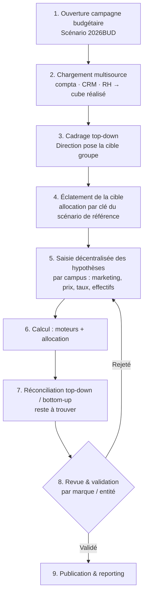

# Modélisation CCH Tagetik — EDUSERVICES

> Conception de la solution Tagetik pour industrialiser la maquette de pilotage.
> Traduit le prototype Excel (`EDUSERVICES_Modele_CA_v3.xlsx`) en objets Tagetik : **dimensions**, **datasets**, **moteurs de calcul**, **workflow**, **états de saisie** et **états de restitution**.

---

## 1. Principes de conception Tagetik

1. **Stockage à la maille la plus fine.** Tagetik stocke chaque fait à l'intersection des **feuilles (leaf)** de *toutes* les dimensions. Une mesure qui ne « descend » pas jusqu'à une dimension doit pointer un **membre technique** (ex. `N_A`) — sinon elle ne peut être ni stockée, ni agrégée proprement.
2. **Éléments techniques** pour ce qui n'est pas comptable ou pas alloué : **entité technique Siège**, **comptes techniques** (statistiques, drivers, prix), **membres `N_A`** sur les dimensions analytiques.
3. **Dimensions obligatoires** (Entité, Scénario, Période, Compte, Devise) + **dimensions personnalisées** (Marque, Campus, Programme, Modalité, Année cursus).
4. **Séparer le stockage (cube) du calcul (moteurs) et de la saisie/restitution (formulaires & reports)**.
5. **Une seule source de vérité** : le réalisé est chargé (multisource), tout le reste est **calculé** par les moteurs.

---

## 2. Les dimensions

| Dimension | Type | Membres (exemples) | Hiérarchie | Rôle |
|---|---|---|---|---|
| **Entité** | Obligatoire | `EDU_GROUPE` › `MBWAY` › `MBWAY_LYON` … + `SIEGE` (technique) | Groupe → Marque → Campus | Périmètre & consolidation |
| **Scénario** | Obligatoire | `2023ACT_VDEF`, `2024ACT_VDEF`, `2025ATT_VDEF`, `2026BUD_V1` | Par type (Actual/Forecast/Budget) | Versioning |
| **Catégorie** | Obligatoire | `ACTUAL`, `FORECAST`, `BUDGET` | — | Nature de version (couplée au scénario) |
| **Période** | Obligatoire | Exercice **clos 31/08** → `FY2025` › `M01…M12` (sept→août) | Année → Mois | Temps (calendrier décalé) |
| **Devise** | Obligatoire | `EUR` | — | Multidevise (mono ici) |
| **Compte / Nature** | Obligatoire | PCG (`706`, `6411`, `613`…) + techniques (`STA_`, `DRV_`, `PRX_`, `MKT_`) | Classe → Poste → Compte **et** hiérarchie de gestion (SIG) | Mesures financières & statistiques |
| **Marque** | Personnalisée | `MBWAY`, `ISCOM`, `IPAC`, `PIGIER`, `TUNON` | — (ou portée par Entité) | Axe marque |
| **Programme** | Personnalisée | `BACH_MGT`, `MAST_COM`, `BTS_GES`… + `N_A` | Domaine → Programme | Offre |
| **Modalité** | Personnalisée | `ALT`, `INIT` + `N_A` | — | Alternance / Initial |
| **Année cursus** | Personnalisée | `B1`,`B2`,`B3`,`M1`,`M2`,`BTS1`,`BTS2` + `N_A` | Cycle → Année | Cohorte |

> **Note calendrier :** l'exercice clôt au **31/08**. La dimension Période doit démarrer en septembre (`M01 = sept`), sinon budget et réalisé se désalignent.

---

## 3. Les éléments techniques (le point clé « sinon crée des éléments techniques »)

Parce que Tagetik stocke au leaf de chaque dimension, on crée :

**Entité technique**
- `SIEGE` (ou `GROUPE_NA`) : porte les coûts non affectés à un campus (direction, honoraires, marque) **avant** allocation.

**Membres `N_A`** (non applicable) sur Programme, Modalité, Année cursus
- Portent les mesures qui **ne descendent pas** à cette maille : coûts de structure/siège (pas de programme), budget marketing campus (pas d'année cursus), etc.

**Comptes techniques** (dimension Compte, hors PCG)

| Préfixe | Usage | Exemples |
|---|---|---|
| `STA_` | Statistiques (volumes) | `STA_LEADS`, `STA_CAND`, `STA_ADMIS`, `STA_INSCR`, `STA_REINSCR`, `STA_EFFECTIF`, `STA_CLASSES` |
| `DRV_` | Drivers / taux | `DRV_TXLC`, `DRV_TXCA`, `DRV_YIELD`, `DRV_PASSAGE`, `DRV_CPL`, `DRV_PARTORG`, `DRV_RENDEMENT` |
| `PRX_` | Prix | `PRX_TARIF`, `PRX_COEFF` |
| `MKT_` | Marketing | `MKT_BUDGET_PAYANT` |

> Ces comptes techniques cohabitent avec les comptes PCG dans la **même dimension Compte** : c'est ce qui permet à un moteur de faire `CA = STA_EFFECTIF × PRX_TARIF` puis de reclasser vers `706/7062`.

---

## 4. Les datasets

Découpage par nature (recommandé pour la performance et la lisibilité) :

| Dataset | Maille (dimensions actives) | Contenu |
|---|---|---|
| **DS_STAGING** | Selon source | Zone d'atterrissage du **chargement multisource** (compta, CRM/admissions, RH) avant mapping |
| **DS_ADMISSIONS** | Entité(campus) × Scénario × Période × Compte(`STA_`,`DRV_`) × Programme × Modalité × Année cursus | Funnel & cohorte (leads → inscrits, effectifs) |
| **DS_MARKETING** | Entité(campus) × Scénario × Période × Compte(`MKT_`,`DRV_CPL`,`DRV_RENDEMENT`,`DRV_PARTORG`) | Budget & acquisition (leads) — Programme/Modalité = `N_A` |
| **DS_FINANCE** | Entité × Scénario × Période × Compte(PCG) × Programme × Modalité × Année cursus | P&L (produits & charges), avec `N_A` pour les coûts non ventilés |

Les datasets sont **reliés par les moteurs** : DS_ADMISSIONS produit `STA_EFFECTIF`/CA → reclassé en produits PCG dans DS_FINANCE.

---

## 5. Les moteurs de calcul (mapping de nos formules)

| Étape (prototype) | Moteur Tagetik | Logique |
|---|---|---|
| Chargement réalisé | **Data Integration / Mapping** | Sources → DS_STAGING → cube, mapping comptes & entités |
| Budget → leads | **Business Rule** (formule) | `Leads = organiques + payants_réf × (Budget/Budget_réf)^DRV_RENDEMENT` |
| Funnel | **Business Rules** | `STA_CAND = STA_LEADS × DRV_TXLC` ; `STA_INSCR = STA_CAND × DRV_TXCA × DRV_YIELD` |
| Cohorte (réinscrits) | **Business Rule avec décalage de dimension** | `STA_REINSCR(année N) = STA_EFFECTIF(année N-1) × DRV_PASSAGE` (lag sur *Année cursus*) |
| CA | **Business Rule** | `CA = STA_EFFECTIF × PRX_TARIF × (1 + hausse × PRX_COEFF)` |
| Reclassement STA → PCG | **Business Rule de mapping** | `706/7062/708 ← CA` selon Modalité |
| Allocation structure/siège → campus | **Moteur d'Allocation (driver-based)** | Clé = CA / effectif / classes ; `SIEGE` → campus |
| Sous-totaux SIG (marge, EBITDA, EBIT) | **Hiérarchie Compte + Business Rules** | Agrégation par la hiérarchie de gestion |
| Consolidation | **Agrégation hiérarchie Entité** | Campus → Marque → Groupe |
| Cadrage top-down (éclatement) | **Allocation top-down** | Cible groupe éclatée par clé du scénario de référence |

> **Rendement décroissant** : la formule `^DRV_RENDEMENT` (puissance) est native en Business Rule. Le **socle organique** est une part fixe (`DRV_PARTORG`) non pilotée par le budget.

---

## 6. Le workflow (CPM Process)

**Statuts par entité** : `Ouvert` → `En saisie` → `Soumis` → `Validé` → `Publié`. Le workflow gère les **tâches, responsables et approbations** entité par entité, avec verrouillage après validation.

---

## 7. États de saisie (Data Entry Forms)

| Formulaire | Acteur | Dimensions en saisie | Contenu |
|---|---|---|---|
| **F1 — Cadrage** | Direction / CDG | Entité=`EDU_GROUPE`, Scénario=Budget | Objectif CA & EBITDA, choix de scénario |
| **F2 — Hypothèses commerciales** | Responsable campus | Entité=campus, Scénario=Budget | Budget marketing, hausse prix, gains conversion, passage |
| **F3 — Hypothèses coûts** | Campus / CDG | Entité=campus/`SIEGE` | Inflation charges, politique salariale, effectifs permanents, loyers |
| **F4 — Drivers & coefficients** | Contrôle de gestion | Compte=`DRV_`,`PRX_` | Coeff prix, part organique, CPL, rendement |

> Chaque formulaire fixe les dimensions non saisies (contexte) et n'ouvre que les cellules pilotables, sous contrôle du workflow (verrou après soumission).

---

## 8. États de restitution (Reports)

| Report | Contenu | Dimensions en axe |
|---|---|---|
| **R1 — P&L SIG multi-scénario** | CA → marge de contribution → EBITDA → EBIT, N-2/N-1/ATT/**Budget** | Compte (SIG) × Scénario ; filtre Entité |
| **R2 — Tableau de bord admissions** | Funnel (leads→inscrits), taux, CPL, effectifs, remplissage | Programme × Modalité × Campus |
| **R3 — Bridge de variance** | Pont CA & EBITDA (volume / prix / mix / coûts) | Scénario→Scénario |
| **R4 — Suivi du cadrage** | Objectif vs budget construit, **reste à trouver** | Entité × Scénario |
| **R5 — Analyse maille fine** | Rentabilité marque × campus × programme | toutes dimensions analytiques |

---

## 9. Sécurité & rôles

| Rôle | Droits |
|---|---|
| Direction | Cadrage, validation groupe, lecture globale |
| Contrôle de gestion | Paramétrage moteurs, drivers, réconciliation, validation |
| Responsable campus | Saisie hypothèses de son entité, lecture de son périmètre |
| Lecture | Reporting uniquement |

La **sécurité par dimension** (Entité) garantit que chaque campus ne voit et ne saisit que son périmètre.

---

## 10. Correspondance prototype Excel → Tagetik

| Élément Excel | Objet Tagetik |
|---|---|
| `01_Cadrage` (objectif, scénarios, leviers) | Formulaires **F1–F4** + dimension **Scénario** |
| `02_Base` (leads, taux, revenus) | Réalisé chargé dans **DS_ADMISSIONS / DS_FINANCE** (comptes `STA_`,`DRV_`,`PRX_`) |
| `03_Campagnes` (budget→leads) | **DS_MARKETING** + Business Rule d'acquisition |
| `04_Moteur` (funnel→CA) | **Business Rules** funnel/cohorte/CA sur DS_ADMISSIONS |
| `05_Plan_Comptable` (PCG + hiérarchies) | Dimension **Compte** + hiérarchies comptable & SIG |
| `06_Compta` (format long, clés, versions) | Faits du cube **DS_FINANCE** (Entité × Compte × Scénario × Période) |
| `07_PnL` (SIG, N-2/N-1/ATT/Budget) | Report **R1** + moteurs SIG + allocation |
| Allocation par driver | **Moteur d'Allocation** |
| Colonne Budget N+1 | Scénario `2026BUD` calculé par les moteurs |

---

## 11. Points de vigilance

- **Calendrier 31/08** : caler la dimension Période (M01 = septembre).
- **Membres `N_A`** obligatoires sur Programme/Modalité/Année cursus pour les coûts non ventilés (sinon perte de stockage).
- **Alternance / NPEC** : le revenu alternance (`7062`) est réglementé — prévoir un scénario de **sensibilité NPEC** (choc réglementaire) via un driver.
- **Ordre des moteurs** : chargement → acquisition → funnel → cohorte → CA → reclassement → allocation → SIG → consolidation. À sequencer dans le workflow de calcul.
- **Réconciliation top-down / bottom-up** : la clé d'éclatement vient du **scénario de référence** (dernier atterrissage).
